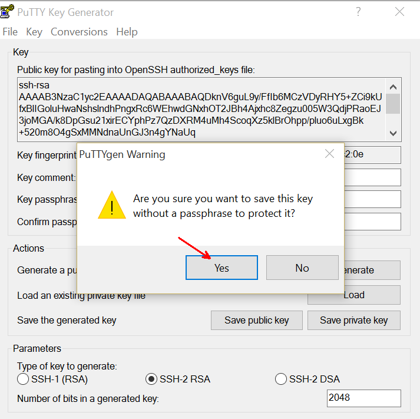

#Linux on Azure

Here is some documentation on how to create and use Linux VMs hosted in Azure.

##prepare your local environment

Your local environment may be MAC, Windows or Linux

###portal or the command line 

You can manage most of the things from the [portal](http://portal.azure.com) which works from most HTML 5 browsers.

If you prefer to do everything from the command line, you can download and install the Azure command line interface (Azure CLI) from azure.com, resources, downloads, and search for "Azure command-line interface".

###prepare your SSH key

If you already have your SSH keys, you may skip this.

On Windows, we'll use a bash command line prompt to generate keys and access to the VMs thru ssh. This documentation as been tested with the one provided by the [git client](http://www.git-scm.com/downloads).

We will be using SSH keys to connect to the different VM created in this Workshop. Use the following commands to create SSH keys:

(replace john and 3-4.fr by your own values)

```
ssh-keygen -t rsa -C "john@3-4.fr"
```

Enter **`john`** for the file name and do not set any passphrase. This will create 2 files:

* `john` : identification/private key
* `john.pub` : public key

Create a Certificate that will be used to create new VMs from the Azure CLI (Command Line Interface):

On MAC or Linux:

```
openssl req -x509 -days 365 -new -key john -out john.pem
```

On Windows:
```
openssl req -config /usr/ssl/openssl.cnf -x509 -days 365 -new -key john -out john.pem
```

Entered the following (exemple):
```
Country Name (2 letter code) [AU]:FR
State or Province Name (full name) [Some-State]:France
Locality Name (eg, city) []:Paris
Organization Name (eg, company) [Internet Widgits Pty Ltd]:john
Organizational Unit Name (eg, section) []:john
Common Name (eg, YOUR name) []:john
Email Address []:john@3-4.fr
```

You shoud now have the following files: 

- a private key file: john
- a public key file: john.pub
- a certificate file: john.pem

##create a Linux VM

You have samples on how to create Linux VMs from the portal or from Azure CLI and bash scripts in the following GitHub repo: [https://github.com/benjguin/mongodb-on-azure-workshop](https://github.com/benjguin/mongodb-on-azure-workshop).

##connect to the Linux VM

You can then connect to the VM from any SSH client. 

You can get the URL from the portal. It is usually `<thenameofthevm>.cloudapp.net`on port 22.


Here is an example from the git client in Windows: 


##create an SSH tunnel

In some cases, you may need to open an SSH tunnel so that your laptop can access the same resources as the Linux VM you are connected to.
One of the use cases is a [Linux HDInsight cluster](HDInsight.md).

Here is a way to do it from Windows.

- download Putty from [http://www.chiark.greenend.org.uk/~sgtatham/putty/download.html](http://www.chiark.greenend.org.uk/~sgtatham/putty/download.html)
- You can use the .zip option and unzip everything in a folder where you'll get at least PUTTY.EXE and PUTTYGEN.EXE
- use PUTTYGEN.EXE to save a copy of your SSH private key in putty format. For example, here is how to create john.ppk from john:





Then, you use PUTTY.EXE to open a session and act as a proxy.
For that you need to configure the session to act as an SSH tunnel. 
PUTTY.EXE will generate a proxy that can be used by a browser that acts as if it was running from the VM you are connected to.

Here is an example where I am connected to the headnode, but I need to access the rest of the nodes.


Optionnaly, you may want to change the layout of the ssh terminal Window:


you need to reference the .ppk file (like the john.ppk we generated earlier in this document)


you may want to save the parameters:


then you open the session 


Afterwards, you configure your browser to use PUTTY.EXE as a SOCKS proxy. 
This example is with Firefox: 


Connect to the HDInsight head node, and follow links as if you were browsing from the headnode:


