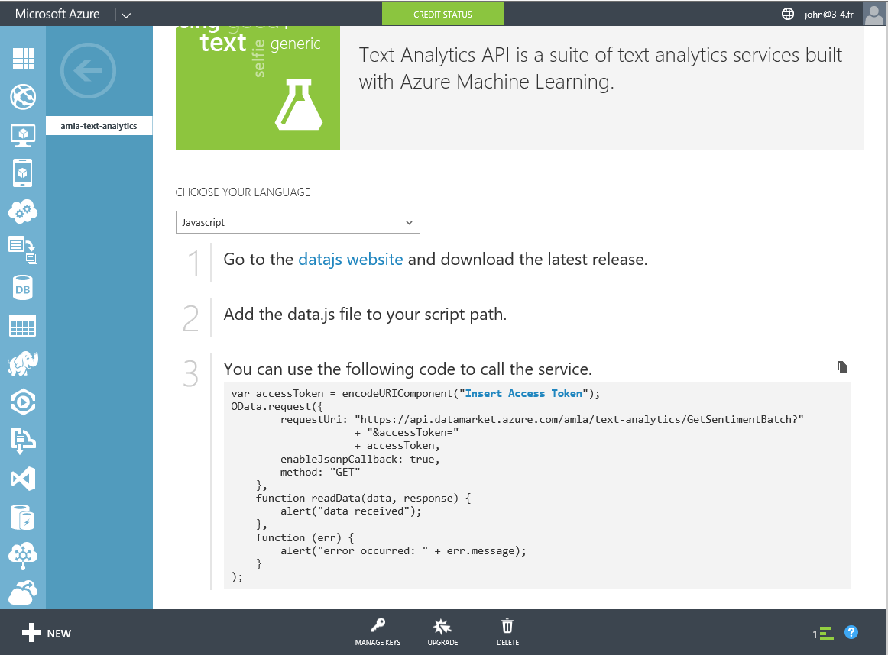
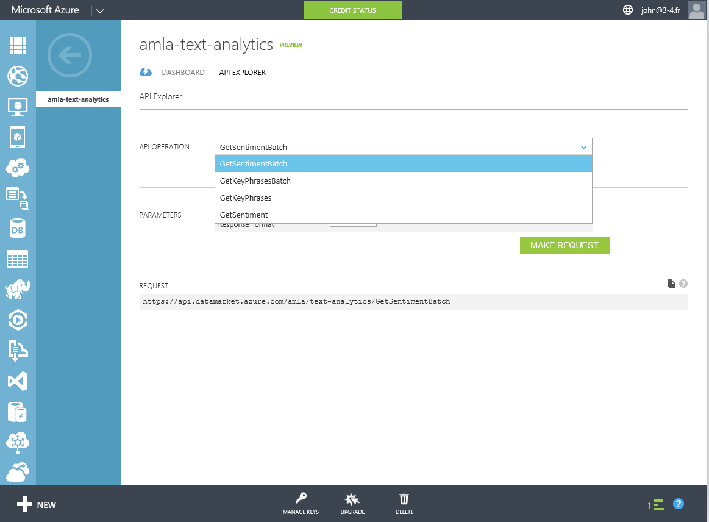
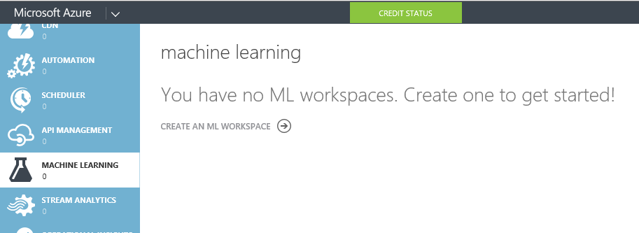
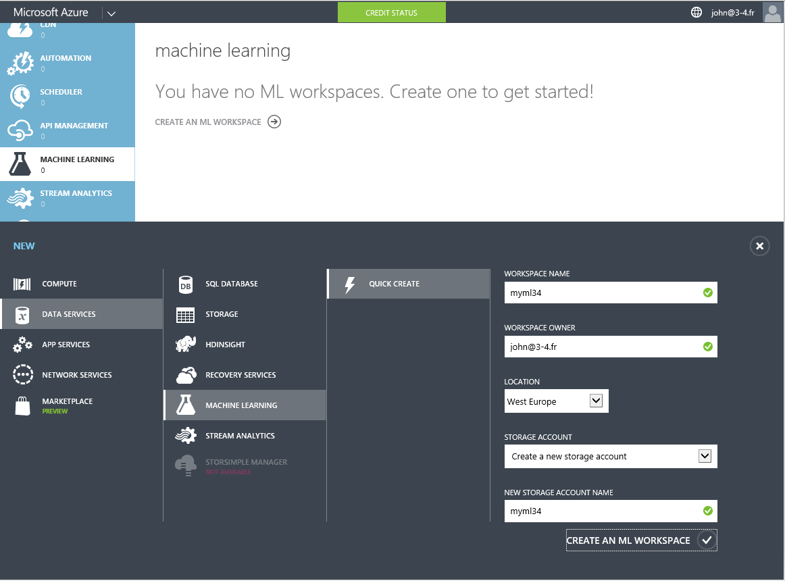
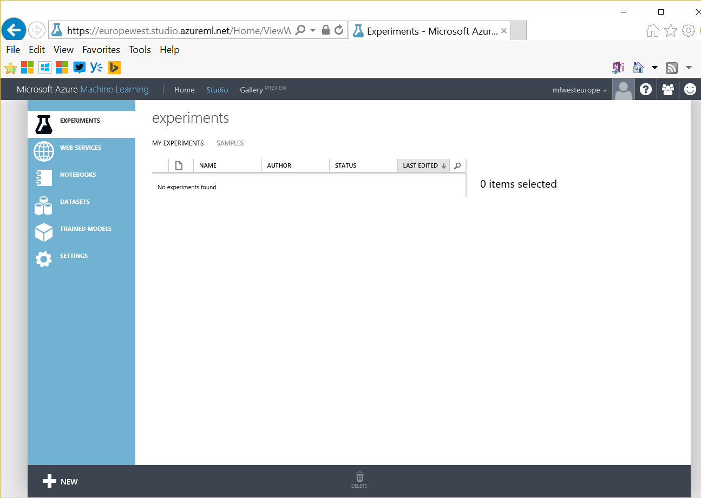

#Azure Machine Learning (Azure ML)

The main page where you can get documentation is at [azure.com/ml](http://azure.com/ml). It contains links to the Machine Learning marketplace (companies selling services that leverage machine learning), Machne Learning APIs (API powered by machine learning provided by Microsoft) and Machine Learning Gallery (sample experiments in Azure Machine Learning, that you can import in your own instance of Azure ML studio).

For instance, once you've "purchased" (0 € for 10000 transactions / month) the Azure ML Text Analytics API service, you get sample code that shows how to use it:

as well as an API explorer:

If you need more control and want to develop your own machine learning experiment you can use Azure ML Studio. 
While there is a free offer, as you get an Azure PASS, you might prefer to create an Azure ML environment from you Azure subscription first. If you do that, you'll get additional options like storing more data, having different endpoints (production, development, ...).

For that, go to [https://manage.windowsazure.com](https://manage.windowsazure.com), MACHINE LEARNING, and create a new workspace. 

prefer "West Europe" as location.

Then you can go to the [Azure ML studio](http://studio.azureml.net).

