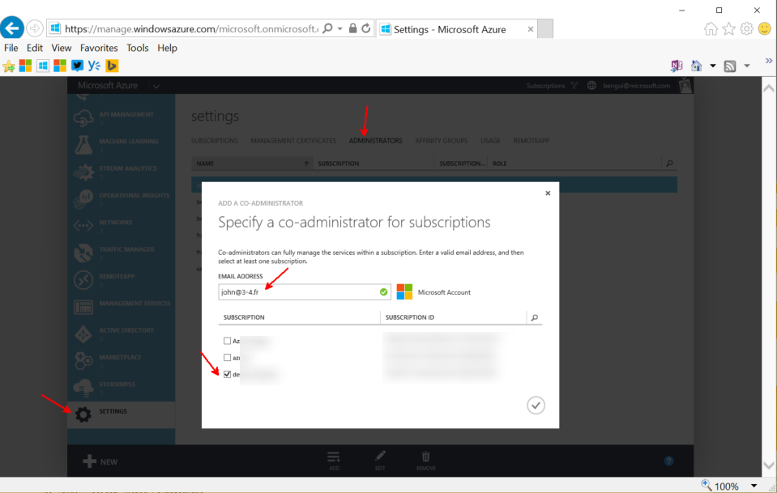

#Azure PASS

The generic documentation to redeem your Azure PASS is at [https://www.microsoftazurepass.com/howto](https://www.microsoftazurepass.com/howto).

For this Hackaton, here are additional details: 

- the country must be: France
- you can only redeem one PASS per Microsoft account. For the team PASS, you might want a member of the team who has no PASS already to redeem the team PASS. 
- Once he has done that, he can add co-admins by going to [https://manage.windowsazure.com](https://manage.windowsazure.com), Settings (at the bottom left of the screen), and add administrators:

