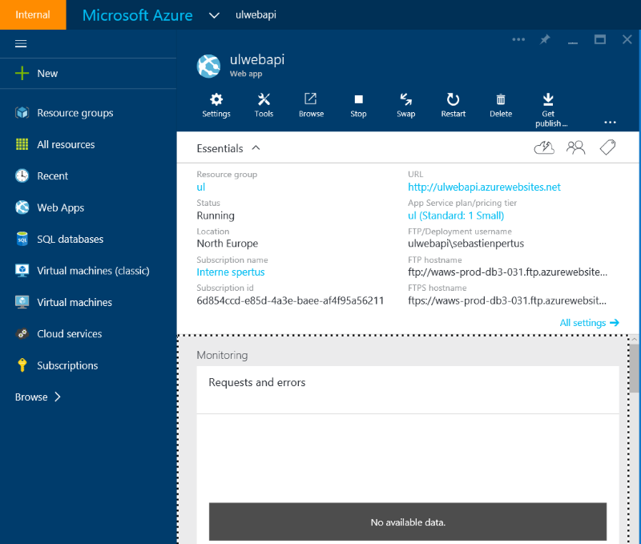

# Exposing your data from an Azure Web App and Node.js

Before exposing your data, be sure to follow thoses steps to create your data repository:

You can use as well: 

* [Create an SQL Database](SQLDatabase.md).
* [Create a NoSQL DocumentDB](DocumentDB.md).

## Create a web app within Azure

Go to [Azure Portal](http://portal.azure.com)

New -> Web + Mobile -> Web App


Once created, you can open your web app dashboard from the portal start menu :



## Continuous Deployment 

If you are familiar with Git and want to use it with Github as well, you can define a Continuous Deployment strategy, in the settings. 

You can choose other repository like Visual Studio Online, Dropbox, Bitbucket etc ...


If you choose to deploy your web solution directly from Visual Studio, and dont want to use any source control system, you dont need to enable this option.

## Buid and deploy an ASP.NET website

To create an ASP.Net web app in Azure, please follow this tutorial : [https://azure.microsoft.com/en-us/documentation/articles/web-sites-dotnet-get-started/](https://azure.microsoft.com/en-us/documentation/articles/web-sites-dotnet-get-started/)


## Exposing datas from a SQL Database through Web API

You can expose your datas through you web app with Web API. 
*  First of all you have to configure a connection string to your database
*  Then download a pre-configured sample with the Server side and the Mobile side

### Configuring the connection string to the database

If you have already an Azure SQL Database, you just have to remember how to writer a correct connection string.

Assuming you have follow the steps described in the [SQL Database chapter](SQLDatabase.md) you will have a SQL Database available with this configuration :
*  SQL Database Server : **mydreamsrv34.database.windows.net**
*  Database : **mydream34**
*  User Id : **john**
*  Password : **TauTheaux001!**

Here is a example :

	Data Source=tcp:mydreamsrv34.database.windows.net,1433;Initial Catalog=mydream34;User ID=john@mydreamsrv34;Password=TauTheaux001!
	
We will use this connection string in the ASP.NET Website.

### Get the pre-configured sample

From the settings page, choose your appropriate sample (Windows C#, iOS, Xamarin, Javascript)


Once downloaded open them in Visual Studio :

**Before start coding or anything else, make a quick Compilation to restore the nuget packages !**

Here is a screenshot of my solution opened in Visual Studio where I have :
* A mobile solution ulwebapi containing an universal Windows 8.1 / Windows Phone 8.1 project
* A server solution ulwebapiService containing a ASP.NET Web API project.


### Server Side ###

Before starting, you need to change your connection string.
Open the **web.config** file and replace (or add) the following section :


```xml
  <connectionStrings>
    <add name="MS_TableConnectionString" connectionString="Data Source=tcp:mydreamsrv34.database.windows.net,1433;Initial Catalog=mydream34;User ID=john@mydreamsrv34;Password=TauTheaux001!"
      providerName="System.Data.SqlClient" />
  </connectionStrings>
```
Now you will have to add **Models** and **Controllers** to your Web API project.

Follow this tutorial : [Web API with Entity Framework 6](http://www.asp.net/web-api/overview/data/using-web-api-with-entity-framework/part-2)


If you need to go deeper, you will find here the complete [.NET Backend Server SDK documentation](https://azure.microsoft.com/en-us/documentation/articles/app-service-mobile-dotnet-backend-how-to-use-server-sdk/).


### Client Side ###

From the mobile solution, open the **App.xaml.cs** file.

You will find the pre-configured Azure Gateway authentification, using the **Mobile Service SDK**.

Be sure to comment the *Production lines* and uncomment the *Local lines* to be able to debug your local server website.

```javascript
        // This MobileServiceClient has been configured to communicate with the Azure Mobile Service and
        // Azure Gateway using the application key. You're all set to start working with your Mobile Service!
        // public static MobileServiceClient MobileService = new MobileServiceClient(
        //    "https://ulwebapi.azurewebsites.net",
        //    "https://ul6d854ccde85d4a3ebaeeaf4f95a56211.azurewebsites.net",
        //    ""
        //);

        // Uncomment this code for configuring the MobileServiceClient to communicate with your local
        // test project for debugging purposes.
         public static MobileServiceClient MobileService = new MobileServiceClient(
             "http://localhost:59998"
         );
```


# Exposing datas from DocumentDB through Web API 

To be able to target a DocumentDB NoSQL database instead of SQL Database, you will have to change the server side of your ASP.NET website.

Please follow the instructions provided here : [Use Azure DocumentDB with Azure Mobile Services](http://giventocode.com/how-to-use-azure-documentdb-with-azure-mobile-services#.VgQaPTYVjF4)

the idea is to *replace* the SQL DomainManager with a DocumentDB DomainManager :


## Document Domain Manager

For the implementation of the domain manager for DocumentDB, we will implement the methods shown in the diagram below, and to do this we will leverage the DocumentDB .NET SDK.


The methods are basically the same as those used for the interface *IDomainManager< T >*. 

Notice that we are not explicitly implementing this interface due to the constraint that makes instances of <T> implement the ITableData interface. ITableData defines basic properties that are not applicable for a document stored in DocumentDB. 

You can check the full implementation [here](http://snipplr.com/view/79883/document-entity-domain-manager/).

## Document Domain Controller

Next, we will need to implement a base (abstract) controller that expects the domain manager we just discussed. In addition, we need to define a base type for our document entities. The DocumentDB client has a handy class called Resource, which has some basic properties that reflect key metadata of a document entity as well as an ID property. So let’s require that all document entities derive from this class by placing a constraint in our controller. 


The following figure shows the constraint and the methods we will need to implement. You can check the complete implementation [here](http://snipplr.com/view/79884/documentdb-controller/).


## Playing with DocumentDB

Here is a quick sample on how to create a straightforward API to expose DocumentDB items :

The entity :

```vb
public class DocumentTodoItem:Resource
    {

        [JsonProperty(PropertyName = "name")]
        public string Name { get; set; }

        [JsonProperty(PropertyName = "desc")]
        public string Description { get; set; }

        [JsonProperty(PropertyName = "isComplete")]
        public bool Completed { get; set; }
    }
```

The controller :

```vb
public class TodoItemDocumentController:DocumentController<DocumentTodoItem>
    {
        protected override void Initialize(HttpControllerContext controllerContext)
        {
            base.Initialize(controllerContext);
            DomainManager = new DocumentEntityDomainManager<DocumentTodoItem>("AMSDocumentDB", "todolist", Request, Services);
        }

        public IQueryable<DocumentTodoItem> GetAllTodoItems()
        {
            return Query();
        }

        public SingleResult<DocumentTodoItem> GetTodoItem(string id)
        {
            return Lookup(id);
        }

        public Task<DocumentTodoItem> ReplaceTodoItem(string id, DocumentTodoItem item)
        {
            return ReplaceAsync(id, item);
        }

        public async Task<IHttpActionResult> PostTodoItem(DocumentTodoItem item)
        {
            var doc = await InsertAsync(item);     
            
            return CreatedAtRoute("DefaultApis", new { id = doc.Id }, doc);
        }

        public Task DeleteTodoItem(string id)
        {
            return DeleteAsync(id);
        }
    }
```


