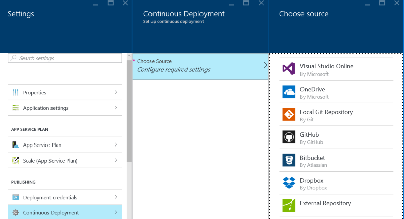

# Exposing your data from an Azure Web App and Node.js

Before exposing your data, be sure to follow thoses steps to create your data repository:

You can use as well: 

* [Create an SQL Database](SQLDatabase.md).
* [Create a NoSQL DocumentDB](DocumentDB.md).


## In a Nutshell

I strongly suggest you to follow the tutorial described here, but if you want some quick samples, you can find starters here : 

* using **Asp.Net** & **DocumentDB** to request a document node : [NOT AVAILABLE FOR THE MOMENT] [ulwebserverdb.zip](webapp/samples/ulwebserverdb.zip)
* using **Asp.Net** & **SqlDatabase** to request a table : [ulwebserversql.zip](webapp/samples/ulwebserversql.zip)


## Create a web app within Azure

Go to [Azure Portal](http://portal.azure.com)

New -> Web + Mobile -> Web App


Once created, you can open your web app dashboard from the portal start menu :


## Continuous Deployment 

If you are familiar with Git and want to use it with Github as well, you can define a Continuous Deployment strategy, in the settings. 

You can choose other repository like Visual Studio Online, Dropbox, Bitbucket etc ...



If you choose to deploy your web solution directly from Visual Studio, and dont want to use any source control system, you dont need to enable this option.


## Exposing datas from a SQL Database through Web API

You can expose your datas through you web app with Web API. 

You can follow this great tutorial :
* Create the project : [http://www.asp.net/web-api/overview/data/using-web-api-with-entity-framework/part-1]
* Add Models and Controllers : [http://www.asp.net/web-api/overview/data/using-web-api-with-entity-framework/part-2]


### Configuring the connection string to the database

If you have already an Azure SQL Database, you just have to remember how to writer a correct connection string.

Assuming you have follow the steps described in the [SQL Database chapter](SQLDatabase.md) you will have a SQL Database available with this configuration :
*  SQL Database Server : **mydreamsrv34.database.windows.net**
*  Database : **mydream34**
*  User Id : **john**
*  Password : **TauTheaux001!**

Here is a example :

	Data Source=tcp:mydreamsrv34.database.windows.net,1433;Initial Catalog=mydream34;User ID=john@mydreamsrv34;Password=TauTheaux001!
	
We will use this connection string in the ASP.NET Website config file :

```xml
  <connectionStrings>
    <add name="MS_TableConnectionString" connectionString="Data Source=tcp:mydreamsrv34.database.windows.net,1433;Initial Catalog=mydream34;User ID=john@mydreamsrv34;Password=TauTheaux001!"
      providerName="System.Data.SqlClient" />
  </connectionStrings>
```


# Exposing datas from DocumentDB through Web API 

To be able to target a DocumentDB NoSQL database instead of SQL Database, you will have to change the server side of your ASP.NET website.

Please follow the instructions provided here : 
[Use Azure DocumentDB SDK](https://azure.microsoft.com/en-us/documentation/articles/documentdb-get-started/)

## Adding the nuget package

After having created your web app like SQL Database, dont forget to add the correct Nuget package :

Just make a search with the keyword "**documentdb**" :


TO BE UPDATED DURING THE WEEK


