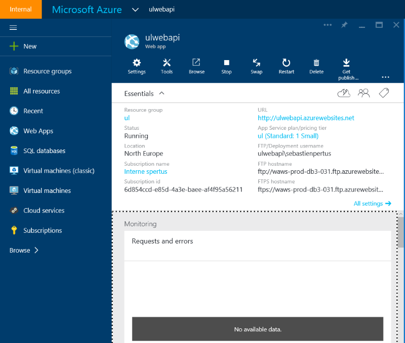
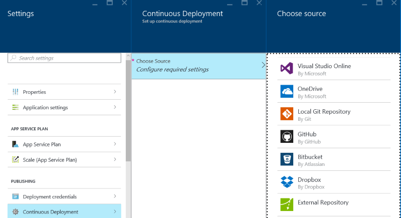
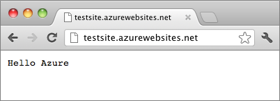

# Exposing your data from an Azure Web App and Node.js

Before exposing your data, be sure to follow thoses steps to create your data repository:

You can use as well: 

* [Create an SQL Database](SQLDatabase.md).
* [Create a NoSQL DocumentDB](DocumentDB.md).

## Create a web app within Azure

Go to [Azure Portal](http://portal.azure.com)

New -> Web + Mobile -> Web App


Once created, you can open your web app dashboard from the portal start menu :



## Continuous Deployment 

If you are familiar with Git and want to use it with Github as well, you can define a Continuous Deployment strategy, in the settings. 

You can choose other repository like Visual Studio Online, Dropbox, Bitbucket etc ...



If you choose to deploy your web solution directly from Visual Studio, and dont want to use any source control system, you dont need to enable this option.

## Buid and deploy a Node.js web app


To create a Node.js web app hosted in your Azure Web App, just follow this tutorial :  
[Build and deploy a Node.js web app](https://azure.microsoft.com/en-us/documentation/articles/web-sites-nodejs-develop-deploy-mac/)



## Connecting your Node.js web app to DocumentDB

To be able to connect your Node.js web app with DocumentDB, we strongly recommand you to use this npm package : [https://github.com/Azure/azure-documentdb-node](https://github.com/Azure/azure-documentdb-node). 

    npm install async --save
    npm install documentdb --save

Here is a small sample on how to use the documentdb node sdk :


``` javascript
var DocumentClient = require('documentdb').DocumentClient;

var host = "[hostendpoint]";                     // Add your endpoint
var masterKey = "[database account masterkey]";  // Add the massterkey of the endpoint
var client = new DocumentClient(host, {masterKey: masterKey});

var databaseDefinition = { id: "sample database" };
var collectionDefinition = { id: "sample collection" };
var documentDefinition = { id: "hello world doc", content: "Hello World!" };

client.createDatabase(databaseDefinition, function(err, database) {
    if(err) return console.log(err);
    console.log('created db');

    client.createCollection(database._self, collectionDefinition, function(err, collection) {
        if(err) return console.log(err);
        console.log('created collection');

        client.createDocument(collection._self, documentDefinition, function(err, document) {
            if(err) return console.log(err);
            console.log('Created Document with content: ', document.content);

            cleanup(client, database);
        });
    });
});

function cleanup(client, database) {
    client.deleteDatabase(database._self, function(err) {
        if(err) console.log(err);
    })
}
```

You will find the full SDK documentation here : 
[http://azure.github.io/azure-documentdb-node/](http://azure.github.io/azure-documentdb-node/)

As well, here is a quick tutorial on how to create a Node.js web app with DocumentDB :
[Build a Node.js web app with DocumentDB](https://azure.microsoft.com/en-us/documentation/articles/documentdb-nodejs-application/)

After completing this tutorial, you will have a ToDO list sample available :


## Connecting your Node.js web app to SQL Database

To be able to connect your Node.js web app to any SQL Database (On premise SQL Server or Azure SQL Database) we recommand you to use this npm package :
[mssql database connector](https://github.com/patriksimek/node-mssql) :

    npm install mssql

Here is a quick sample on how to connect your Node.js web app to an Azure SQL Database :

Assuming you have follow the steps described in the [SQL Database chapter](SQLDatabase.md) you will have a SQL Database available with this configuration :
*  SQL Database Server : mydreamsrv34.database.windows.net 
*  Database : mydream34
*  User Id : john
*  Password : TauTheaux001!

Here is the code you need :

```javascript
var sql = require('mssql'); 

var config = {
    user: 'john',
    password: 'ThauTheaux001!',
    server: 'mydreamsrv34.database.windows.net',
    database: 'mydream34',
    
    options: {
        encrypt: true // Use this if you're on Windows Azure
    }
}

var connection = new sql.Connection(config, function(err) {
    // ... error checks
    
    // Query
	
    var request = new sql.Request(connection); // or: var request = connection.request();
    request.query('select 1 as number', function(err, recordset) {
        // ... error checks
        
        console.dir(recordset);
    });
	
    // Stored Procedure
	
    var request = new sql.Request(connection);
    request.input('input_parameter', sql.Int, 10);
    request.output('output_parameter', sql.VarChar(50));
    request.execute('procedure_name', function(err, recordsets, returnValue) {
        // ... error checks
        
        console.dir(recordsets);
    });
});

connection.on('error', function(err) {
	// ... error handler
});
```


