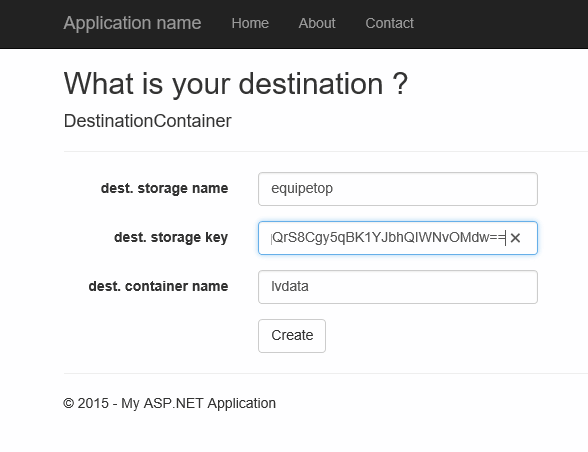

#dataset update 1

##how to get the update

The dataset that you can obtain from the app has been updated.

To get the new data, just go back to the web app 

 

and ask for the data on another container (ex: lvdata2). The storage account can be the same. 

##what does it contain?

Here is the new dataset description. In the container, you'll find the following:


folder | new in update 1 |description
:------|--------:--------|:-------------
crm | Y | The CRM data as 4 files, uncompressed
crmgz | N | the CRM data as 4 files, compressed
crmsqldb | N | the CRM data as a dehydrated SQL database
tweets | Y | The raw tweets, uncompressed
tweetsgz | N | The raw tweets, compressed
tweetstsv | Y | the tweets, filtered (cf explanation below), as TSV files, uncompressed
web-clientid | Y | the Web Analytics data with the ClientId as the last column, uncompressed
web-clientid-gz | Y | the Web Analytics data with the ClientId as the last column, compressed
webgz | N | the Web Analytics without the clientId column, compressed


##tweetstsv

raw tweets has 3,822,924 rows

tweetstsv has 1,835,771 rows

Here are the hive scripts we applied to tweetsgz in order to obtain tweetstsv

```
set hive.execution.engine=tez;
set hive.exec.dynamic.partition=true;
set hive.exec.dynamic.partition.mode=nonstrict;
set mapred.output.compress=false;
set hive.exec.compress.output=false;
set mapred.output.compression.codec=org.apache.hadoop.io.compress.GzipCodec;
set io.compression.codecs=org.apache.hadoop.io.compress.GzipCodec; 

drop table raw_tweets;
create external table raw_tweets
(
	json_response string
) stored as textfile
location 'wasb://tweets@ul001.blob.core.windows.net/';

drop table tweets2;
create external table tweets2 (
	id string,
	lang string,
	json_response string)
row format delimited fields terminated by '\t' lines terminated by '\n' stored as textfile 
location 'wasb://work@ul001.blob.core.windows.net/tweets2';

insert overwrite table tweets2
select 
	get_json_object(json_response, '$.id_str') as id,
	get_json_object(json_response, '$.user.lang') as lang,
	json_response
	FROM raw_tweets
	where (length(json_response) > 500);

drop table tweetstsv;
create external table tweetstsv
(
	id string,
	created_at string,
	created_at_date string,
	created_at_year string,
	created_at_month string,
	created_at_day string,
	created_at_time string,
	in_reply_to_user_id_str string,
	text string,
	contributors string,
	is_a_retweet boolean,
	truncated string,
	coordinates string,
	source string,
	retweet_count int,
	url string,
	first_hashtag string,
	first_user_mention string,
	screen_name string,
	name string,
	followers_count int,
	listed_count int,
	friends_count int,
	lang string,
	user_location string,
	time_zone string,
	profile_image_url string,
	hashtags array<string>,
	user_mentions array<string>
)
row format delimited fields terminated by '\t' lines terminated by '\n' stored as textfile 
location 'wasb://work@ul001.blob.core.windows.net/tweetstsv';

insert overwrite table tweetstsv
select
	get_json_object(json_response, '$.id_str') as id,
	get_json_object(json_response, '$.created_at') as created_at,
	concat(substr (get_json_object(json_response, '$.created_at'),1,10),' ',
		substr (get_json_object(json_response, '$.created_at'),27,4)) as created_at_date,
	substr (get_json_object(json_response, '$.created_at'),27,4) as created_at_year,
	case substr (get_json_object(json_response, '$.created_at'),5,3)
		when "Jan" then "01"
		when "Feb" then "02"
		when "Mar" then "03"
		when "Apr" then "04"
		when "May" then "05"
		when "Jun" then "06"
		when "Jul" then "07"
		when "Aug" then "08"
		when "Sep" then "09"
		when "Oct" then "10"
		when "Nov" then "11"
		when "Dec" then "12" end as created_at_month,
	substr (get_json_object(json_response, '$.created_at'),9,2) as created_at_day,
	substr (get_json_object(json_response, '$.created_at'),12,8) as created_at_time,
	get_json_object(json_response, '$.in_reply_to_user_id_str') as in_reply_to_user_id_str,
	get_json_object(json_response, '$.text') as text,
	get_json_object(json_response, '$.contributors') as contributors,
	(cast (get_json_object(json_response, '$.retweet_count') as int) != 0) as is_a_retweet,
	get_json_object(json_response, '$.truncated') as truncated,
	get_json_object(json_response, '$.coordinates') as coordinates,
	get_json_object(json_response, '$.source') as source,
	cast (get_json_object(json_response, '$.retweet_count') as int) as retweet_count,
	get_json_object(json_response, '$.entities.display_url') as url,
	trim(lower(get_json_object(json_response, '$.entities.hashtags[0].text'))) as first_hashtag,
	trim(lower(get_json_object(json_response, '$.entities.user_mentions[0].screen_name'))) as first_user_mention,
	get_json_object(json_response, '$.user.screen_name') as screen_name,
	get_json_object(json_response, '$.user.name') as name,
	cast (get_json_object(json_response, '$.user.followers_count') as int) as followers_count,
	cast (get_json_object(json_response, '$.user.listed_count') as int) as listed_count,
	cast (get_json_object(json_response, '$.user.friends_count') as int) as friends_count,
	get_json_object(json_response, '$.user.lang') as lang,
	get_json_object(json_response, '$.user.location') as user_location,
	get_json_object(json_response, '$.user.time_zone') as time_zone,
	get_json_object(json_response, '$.user.profile_image_url') as profile_image_url,
	array(	
		trim(lower(get_json_object(json_response, '$.entities.hashtags[0].text'))),
		trim(lower(get_json_object(json_response, '$.entities.hashtags[1].text'))),
		trim(lower(get_json_object(json_response, '$.entities.hashtags[2].text'))),
		trim(lower(get_json_object(json_response, '$.entities.hashtags[3].text'))),
		trim(lower(get_json_object(json_response, '$.entities.hashtags[4].text'))),
		trim(lower(get_json_object(json_response, '$.entities.hashtags[5].text'))),
		trim(lower(get_json_object(json_response, '$.entities.hashtags[6].text'))),
		trim(lower(get_json_object(json_response, '$.entities.hashtags[7].text'))),
		trim(lower(get_json_object(json_response, '$.entities.hashtags[8].text'))),
		trim(lower(get_json_object(json_response, '$.entities.hashtags[9].text')))) as hashtags,
	array(
		trim(lower(get_json_object(json_response, '$.entities.user_mentions[0].screen_name'))),
		trim(lower(get_json_object(json_response, '$.entities.user_mentions[1].screen_name'))),
		trim(lower(get_json_object(json_response, '$.entities.user_mentions[2].screen_name'))),
		trim(lower(get_json_object(json_response, '$.entities.user_mentions[3].screen_name'))),
		trim(lower(get_json_object(json_response, '$.entities.user_mentions[4].screen_name'))),
		trim(lower(get_json_object(json_response, '$.entities.user_mentions[5].screen_name'))),
		trim(lower(get_json_object(json_response, '$.entities.user_mentions[6].screen_name'))),
		trim(lower(get_json_object(json_response, '$.entities.user_mentions[7].screen_name'))),
		trim(lower(get_json_object(json_response, '$.entities.user_mentions[8].screen_name'))),
		trim(lower(get_json_object(json_response, '$.entities.user_mentions[9].screen_name')))) as user_mentions
from tweets2
where coalesce(id, 'X') RLIKE '^[0-9]+$'
	and substr(coalesce(id, 'X'),1,1) RLIKE '[0-9]';

```


