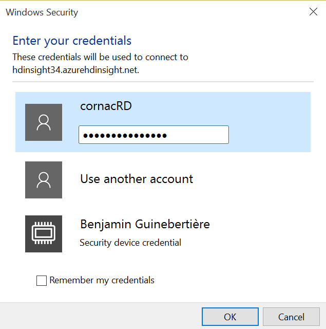

#HDInsight

##how to create a Hadoop & Spark cluster

The description below is with a cluster with Windows nodes. You can also create a Linux cluster as a service. First create a Hadoop Linux cluster like below, then go to Ambari to add Spark if you also need it.

The following description shows how to create a cluster from the portal. You can also create one from the command line [from Windows with PowerShell](https://azure.microsoft.com/en-us/documentation/articles/hdinsight-administer-use-powershell/) or [from Mac, Linux or Windows with xplat-cli](https://azure.microsoft.com/en-us/documentation/articles/hdinsight-administer-use-command-line/).

###create a Hadoop cluster (linux nodes)

Here is a way to create a linux cluster.

The equivalent is available as a PowerShell script in this repo at scripts/powershell/create_hdinsight_cluster_linux.ps1

NB: From Azure CLI, there are less options to customize the configuration of the cluster.

go to [http://portal.azure.com](http://portal.azure.com)


then, you can fill the wizzard with the following values (replace values in *italic* by your own values, some of them like the cluster name must be globally unique). The example values used at creation are reused in this documentation so that you can correlate the fields.

- Cluster Name: *hdi34*
- Cluster Type: Hadoop
- Cluster Operating System: Ubuntu 12.04 LTS (PREVIEW)
- Subscription: *(choose the subscription corresponding to the right PASS subscription)*
- Resource Group: *(leave default or create a new resource group, not very important here)* 
- Credentials
	- Cluster Login Username: admin
	- Cluster Login Password: *TauTheaux007!*
	- Confirm Password: *TauTheaux007!*
	- SSH Username: *john* 
	- SSH Authentication type: *ssh-rsa AAAAB3NzaC1yc2EAAAADAQABAAABAQDknV6guL9y/FfIb6MCzVDyRHY5+ZCi9kUfxBlIGoluHwaNshslndhPngxRc6WEhwdGNxhOT2JBh4Ajxhc8Zegzu005W3QdjPRaoEJ3joMGA/k8DpGsu21xirECYphPz7QzDXRM4uMh4ScoqXz5klBrOhpp/pluo6uLxgBk+520m8O4gSxMMNdnaUnGJ3n4gYNaUq+WbHcaAcbdY6gqnDMPvhAOFdDpkYZ5gO/umeWhJ6nPKMznFTaPvxn5l50zeOTbXi6zJGAd724yXK+PYfaWSyaUof/tBFvOZG2U8q+AQfx+SW5IucGAUQuNayKxCtsYjEpECvNvl2rGwyzwUQUF john@3-4.fr*
- Data Source
	- Selection Method: From all subscriptions
	- Select storage account: *monstockageazure34*
	- Choose Default Container: *hdi34 (leave default, chances are it is the same as the cluster name)*
	- Location: North Europe
- Node Pricing Tiers
	- Number of Worker nodes: *3*
	- Worker Nodes Pricing Tier: *D12*
	- Head Node Pricing Tier: *D12*
- Optional Configuration
	- HDInsight Version: (leave default)
	- Virtual Network: Not Configured
	- External Metastores: Not Configured
	- Script Actions: Not Configured
	- Azure Storage Keys: 
		- Add a storage key
			- Access Key
				- Storage Name: *ul001*
				- Access Key: *fRCyNyx1aHeASX1OTXrT8L7m0sMrGuEBrNFy6XghAwNZ3vwMXx5I7w4HluQ2qQrS8Cgy5qBK1YJbhQIWNvOMdw==*
- Pin to Startboard: checked
- Create

###create a Hadoop & Spark cluster (linux nodes)

You can also create a HDInsight Linux cluster with Spark installed as documented at [https://azure.microsoft.com/en-us/documentation/articles/hdinsight-hadoop-spark-install-linux/](https://azure.microsoft.com/en-us/documentation/articles/hdinsight-hadoop-spark-install-linux/) 

An updated version of the custom script exists that deploys Spark 1.5. Its URI is
`https://hdiconfigactions.blob.core.windows.net/linuxsparkconfigactionv02/spark-installer-v02.sh`

Basically, you use the [portal](https://portal.azure.com) as in the previous step, and you add an optional configuration with the Spark Shell. Spark has only to be deployed on the head node. It will ask YARN to deploy the rest on the data nodes.


	 

###create a Hadoop & Spark cluster (Windows nodes)

Here is a way to create a Hadoop & Spark cluster with Windows nodes from the portal

The equivalent is available as a PowerShell script in this repo at scripts/powershell/create_hdinsight_cluster_windows.ps1


go to [http://portal.azure.com](http://portal.azure.com)


then, you can fill the wizzard with the following values (replace values in *italic* by your own values, some of them like the cluster name must be globally unique). The example values used at creation are reused in this documentation so that you can correlate the fields.

- Cluster Name: *hdinsight34*
- Cluster Type: Spark (PREVIEW)
- Cluster Operating System: Windows Server 2012 R2 Datacenter
- Subscription: *(choose the subscription corresponding to the right PASS subscription)*
- Resource Group: *(leave default or create a new resource group, not very important here)* 
- Credentials
	- Cluster Login Username: *cornac*
	- Cluster Login Password: *TauTheaux007!*
	- Confirm Password: *TauTheaux007!*
	- Enable Remote Desktop: YES
	- Expires On: *(leave default)*
	- Remote Desktop Username: *cornacRD*
	- Remote Desktop Password: *TauTheaux008!*
	- Confirm Password: *TauTheaux008!*
- Data Source
	- Selection Method: From all subscriptions
	- Select storage account: *monstockageazure34*
	- Choose Default Container: *hdinsight34 (leave default, chances are it is the same as the cluster name)*
	- Location: North Europe
- Node Pricing Tiers
	- Number of Worker nodes: *3*
	- Worker Nodes Pricing Tier: *D12*
	- Head Node Pricing Tier: *D12*
- Optional Configuration
	- HDInsight Version: (leave default)
	- Virtual Network: Not Configured
	- External Metastores: Not Configured
	- Script Actions: Not Configured
	- Azure Storage Keys: 
		- Add a storage key
			- Access Key
				- Storage Name: *ul001*
				- Access Key: *fRCyNyx1aHeASX1OTXrT8L7m0sMrGuEBrNFy6XghAwNZ3vwMXx5I7w4HluQ2qQrS8Cgy5qBK1YJbhQIWNvOMdw==*
- Pin to Startboard: checked
- Create

##How to connect to the cluster

###connect thru the Web UI

Connect to https://*hdinsight34*.azurehdinsight.net with *cornac* and *TauTheaux007!*


For a Linux cluster, you may want to use SSH tunelling in order to connect to all nodes inside the cluster from the browser. 
Please see how to do that in the [Linux page of this repo](AzureLinux.md).

###connect thru remote desktop (for command line)

In this mode, you will be able to connect thru the command line to the cluster. If you are familiar with hive thru the command line for instance, this may be a more efficient way to connect to the cluster. 

The connection is done thru a Remote Desktop client. It exists from different stores like the App Store on Mac, by Microsoft Corp.

You can connect from the portal: 





##Hive

Hive is a way to execute distributed processing written as SQL scripts. The documentation is at [https://cwiki.apache.org/confluence/display/Hive/Home](https://cwiki.apache.org/confluence/display/Hive/Home).

In particular, the following pages of the documentation are often useful: 
- [Hive Language Manual - User Defined Functions](https://cwiki.apache.org/confluence/display/Hive/LanguageManual+UDF) actually more standard defined functions than user defined functions!
- [Hive Language Manual - Data Types](https://cwiki.apache.org/confluence/display/Hive/LanguageManual+Types#LanguageManualTypes-Date/TimeTypes)


From HDInsight, you can execute a script from the command line (Windows) in the following way.

Create a local c:\w folder. In this folder, create a 2.hql file for instance. 

Open the command prompt ("Hadoop Command Prompt" icon on the desktop).
the you can `cd ..\hive<TAB>\bin` (press the TAB key instead of <TAB>).

Here is some sample code that starts a local hive script: 


```
C:\apps\dist\hadoop-2.6.0.2.2.7.1-0004>cd ..\hive-0.14.0.2.2.7.1-0004

C:\apps\dist\hive-0.14.0.2.2.7.1-0004>cd bin

C:\apps\dist\hive-0.14.0.2.2.7.1-0004\bin>hive -v -f c:\w\2.hql
Picked up _JAVA_OPTIONS: -Djava.io.tmpdir=C:\tmp
Picked up _JAVA_OPTIONS: -Djava.io.tmpdir=C:\tmp

Logging initialized using configuration in file:/C:/apps/dist/hive-0.14.0.2.2.7.1-0004/conf/hive-log4j.properties
SLF4J: Class path contains multiple SLF4J bindings.
SLF4J: Found binding in [jar:file:/C:/apps/dist/hadoop-2.6.0.2.2.7.1-0004/share/hadoop/common/lib/slf4j-log4j12-1.7.5.ja
r!/org/slf4j/impl/StaticLoggerBinder.class]
SLF4J: Found binding in [jar:file:/C:/apps/dist/hive-0.14.0.2.2.7.1-0004/lib/hive-jdbc-0.14.0.2.2.7.1-0004-standalone.ja
r!/org/slf4j/impl/StaticLoggerBinder.class]
SLF4J: Found binding in [jar:file:/C:/apps/dist/hbase-0.98.4.2.2.7.1-0004-hadoop2/lib/slf4j-log4j12-1.6.4.jar!/org/slf4j
/impl/StaticLoggerBinder.class]
SLF4J: See http://www.slf4j.org/codes.html#multiple_bindings for an explanation.
SLF4J: Actual binding is of type [org.slf4j.impl.Log4jLoggerFactory]
set hive.execution.engine=tez
set hive.exec.dynamic.partition=true
set hive.exec.dynamic.partition.mode=nonstrict


select * from web
where coalesce(OrderTotalAmount, '')<>''
limit 100

Query ID = cornacRD_20150916090808_a2885a98-d1f0-40d5-aa35-4f50c2e43f57
Total jobs = 1
Launching Job 1 out of 1
(...)
```


please also refer to [https://azure.microsoft.com/en-us/documentation/articles/hdinsight-use-hive/](https://azure.microsoft.com/en-us/documentation/articles/hdinsight-use-hive/).
 
 ##Spark SQL
 
 (this documentation may be enhanced soon)
 
 On a small cluster (3 data nodes), you may want to have a ~5 million lines dataset to play with instead of the full ~ 5 billion dataset.
 
 Here what I would recommend: 
 - use Hive + TEZ (cf sample scripts in this GitHub repo) scripts to get an interesting subset of the dataset
 - from Zeppelin, use the same HIVE external tables to hack the data in a more interactive way
 	- the first thing you might want to do is %sql cache table mymilliontable  
  
 Samples in Zeppelin:
 
	%sql 
	cache table webs

	%sql
	select * from webs limit 50
	
	%sql
	select count(*) from webs
	
	%sql
	select 
		weekId, 
		min(HourDate) as minDate, 
		max(HourDate) as maxDate, 
		count(*) as nbLines
	from webs
	group by weekId
	order by weekId asc
