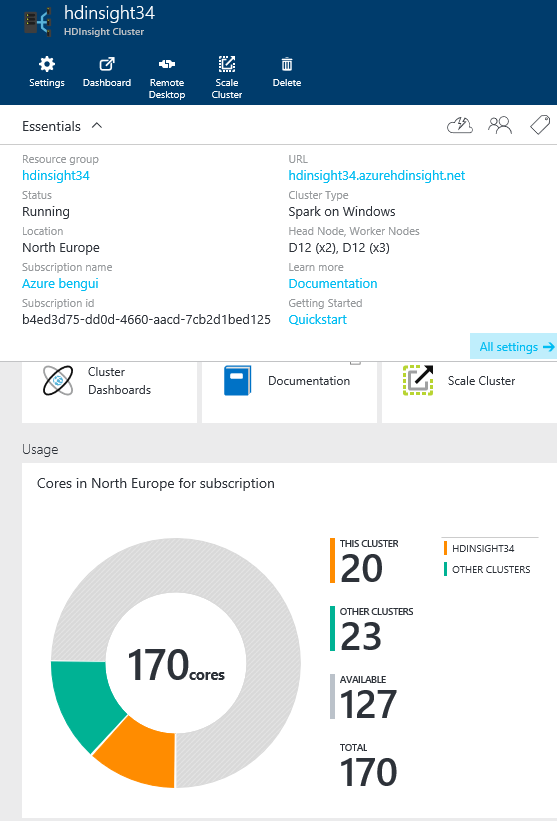
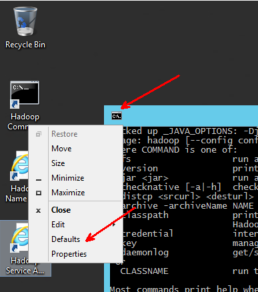
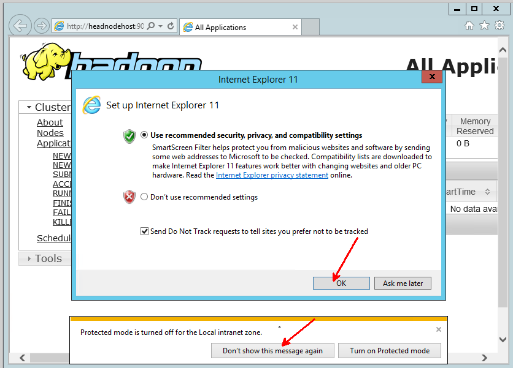
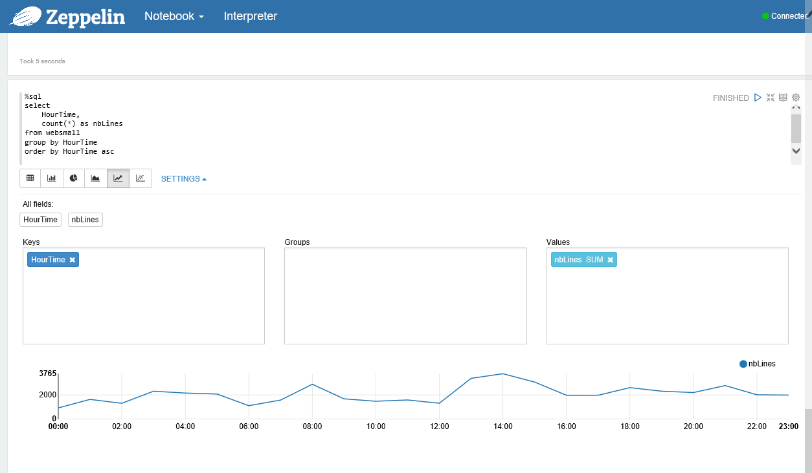

#Hadoop & Spark demos

This document contains the list of the demos during the Hadoop & Spark workshop

##create a cluster

- Show different options: 
	- Explain what is behind https://github.com/Azure/azure-quickstart-templates and how that can be used
		- Cloudera On CentOS
		- Spark on Ubuntu
		- Elastic Search
		- ...
	- marketplace from the portal
		- ex: Hortonworks
	- create a HDInsight cluster from the portal
	- create a HDInsight cluster from Azure PowerShell
		- sample PowerShell scripts
	- documentation: [HDInsight.md](HDInsight.md)
	
##Access the cluster

- Windows cluster
	- RDP
	- Portal
- Linux cluster
	- SSH
	- portal and tunneling with PUTTY and Firefox

##Use HDInsight on the dataset

The demonstrations are done on a small 3 data node cluster with D12 VMs



- Customize the Hadoop command line 
- Say OK to IE 
- start a hive script saved as a local file and issue a few commands

```
cd ..\hive-0.14.0.2.2.7.1-0004\bin
hive -e "show tables;"
mkdir c:\w
notepad c:\w\01_web1col.hql
hive -v -f c:\w\01_web1col.hql
notepad c:\w\02_websgz.hql
hive -v -f c:\w\02_websgz.hql
notepad c:\w\03_websmall.hql
hive -v -f c:\w\03_websmall.hql
```

- show the http://headnodehost:9014/cluster/nodes portal
- show the resource manager at https://hdinsight34.azurehdinsight.net/Spark/ResourceManager 
- show the storage account

 	
- Zeppelin notebook
	- sample notebook	
	- Spark SQL

```
%sql
show tables

%sql 
cache table websmall

%sql
select * from websmall limit 50

%sql
select count(*) from websmall

%sql
select 
	HourTime, 
	count(*) as nbLines
from websmall
group by HourTime
order by HourTime asc
```

- Show graphics too: 