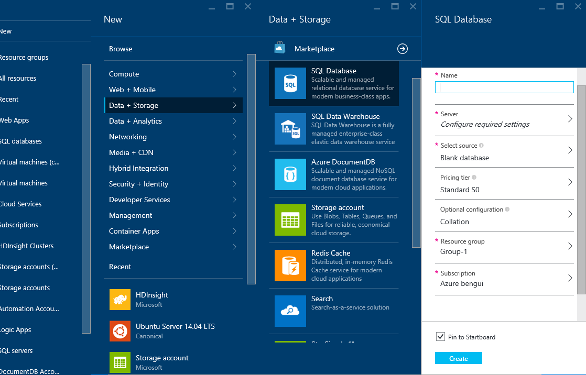
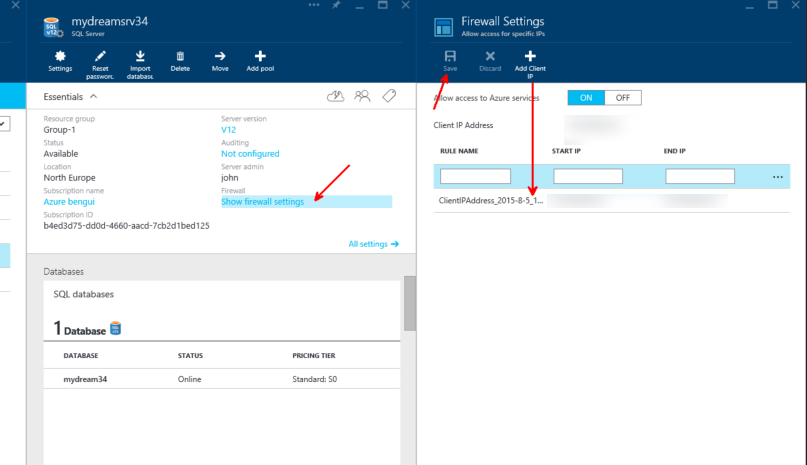

#Create your copy of the SQL CRM database

This step must be done after [having copied the dataset to your Azure subscription](GetTheData.md) 

The database is available as a blob in your Azure storage account, at /lvdata/crmsqldb. It is a .bacpac file.

In order to create a database from that bacpac file, there are several steps: 
- create an empty sql database and its server
- from the server, import the bacpac as a new sql database in the server
- drop the first database that you don't need anymore


do the following:

go to [http://portal.azure.com](http://portal.azure.com)

Choose, New, Data + Storage, SQL Database



then, you can fill the wizzard with the following values (replace values in *italic* by your own values, some of them like the cluster name must be globally unique). 

- Name: *mydream34afac*
- Server:
	- Create a new server:
		- Server Name: *mydreamsrv34*
		- Server admin login: *john*
		- Password: *TauTheaux001!*
		- Confirm password: *TauTheaux001!*
		- Location: North Europe
		- Create V12 server (Lates update): Yes *(NB, if you get an error, you can try with No)*
		- Allow azure services to access services: checked
	- Select source: Blank database
	- Pricing Tier: *Standard S3*
	- Optional Configuration: (leave default)
	- Resource Group: (leave default)
	- Subscription: *(choose the ubscription or leave default value)*


Find the server in the portal, and choose the import option: 

Browse All, SQL Servers, *mydreamsrv34*, Import Database


Import Database:

- Storage: (Find the .bacpac blob in the blob storage account)

- Pricing Tier: *S0* (you can change afterwards if you need a faster database)
- DATABASE NAME: *mydream34*
- Server admin login: *john*
- Password: *TauTheaux001!*


select the **first** database you created, and delete it (don't delete the server nor the database you just imported): 


Add your client IP address to the firewall, as well as other IP ranges you may need:




Then you can access the database from any SQL Server client tool. For instance, you can download a free version of SQL Server Management Studio in SQL Server Express product. The link is available from the portal: 


If you don't have a Windows client, you can create a Windows VM in Azure.

Once installed, you can connect


NB: while doing this, you may see that the database is still importing its data from the bacpac file.

To know, you can check wether the number or records in each table is still raising, you can also see resource utilization, and check your notifications. 


After the import is complete, you should get those numbers: 


the script is

```
select 'Client', count(*) from Client
union all
select 'Segmentation', count(*) from Segmentation
union all
select 'Transactions', count(*) from Transactions
union all
select 'Voice', count(*) from Voice
```
