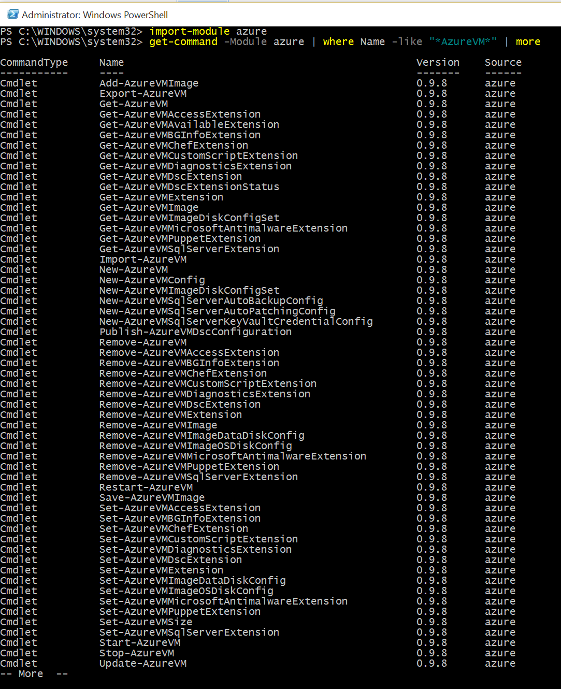
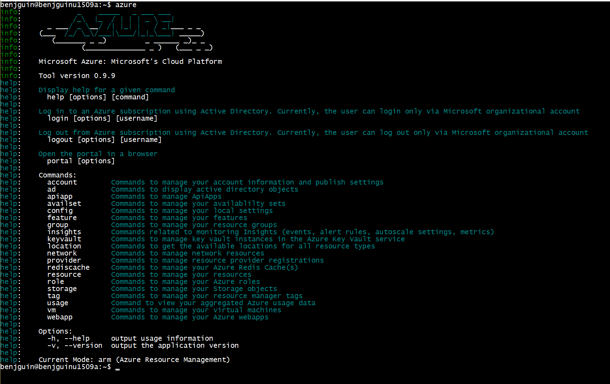
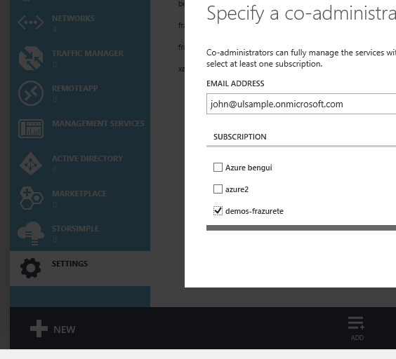
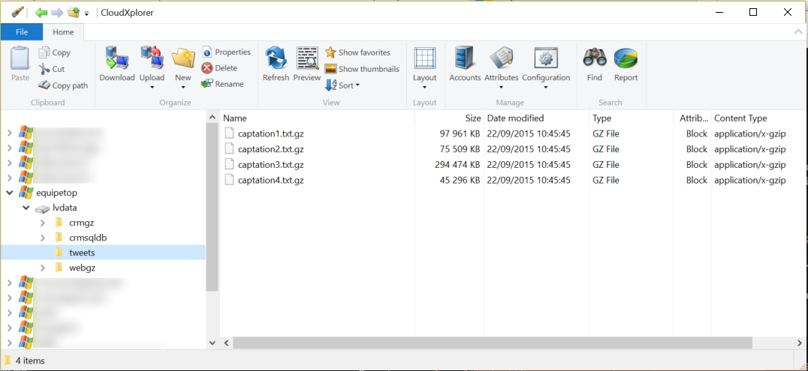
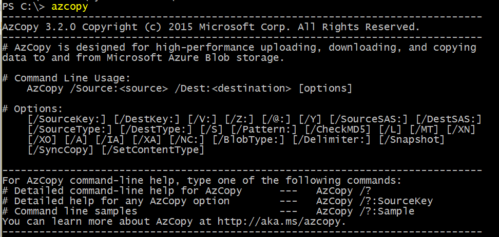

#Tools

##portals

There are 2 portals: 

- [https://portal.azure.com](https://portal.azure.com) is the new portal. It is preferred for most services.  
- [https://manage.windowsazure.com](https://manage.windowsazure.com) is the legacy portal. Some services like Azure Active Directory are available only thru this portal.

##Command line tools

Azure can be used from 2 command line tools. They can be downloaded from [http://azure.com](http://azure.com), resources, downloads.

- PowerShell module is available from a Windows OS (NB: Azure automation is a PowerShell as a service environment).

- Azure Commande Line Interface (Azure CLI) is a cross platform tool written as a Node.js npm module. It can run from Mac, Windows and Linux.
 
 
 NB: the Azure CLI needs an organizational account, while you probably created your Azure subscription from a Microsoft Account (aka Live ID). 
 If you try to connect with a Microsoft Account, you will get this output
 
``` 
:~$ azure login
info:    Executing command login
Username: john.doe@outlook.com
Password: ****************
+ Authenticating...
error:   Looks like you have used live account which is not supported. Please note that currently you can login only via Microsoft organizational acco
unt or service principal. For instructions on how to set them up, please read http://aka.ms/Dhf67j.
info:    Error information has been recorded to /home/benjguin/.azure/azure.err
error:   login command failed
```

You can create an *organizational account* from [https://manage.windowsazure.com](https://manage.windowsazure.com).

- connect to [https://manage.windowsazure.com](https://manage.windowsazure.com) with your Microsoft account
- go to Azure Active Directory   
- if you don't have an Azure Active Directory, you can create one. Let's call it `ulsample.onmicrosoft.com`
- NB: the Microsoft Account you are connected with becomes an admin of that Azure Active Directory 
- create a user in that Active Directory (it does not need to be an administrator). Let's call it `john@ulsample.onmicrosoft.com`).
- go to Settings in [https://manage.windowsazure.com](https://manage.windowsazure.com), and add `john@ulsample.onmicrosoft.com` as an administrator of the subscription

- then you can connect with Azure CLI with that new account `john@ulsample.onmicrosoft.com`.

##Storage explorers

There's a list of Azure storage explorers [here](https://go.microsoft.com/fwLink/?LinkID=296841&clcid=0x409)


There's also a command line tool, [azCopy](http://aka.ms/AzCopy).

